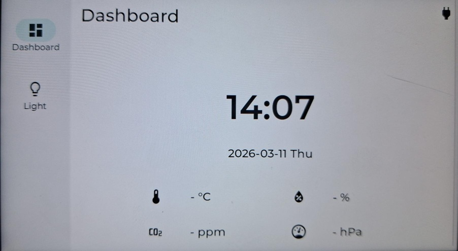
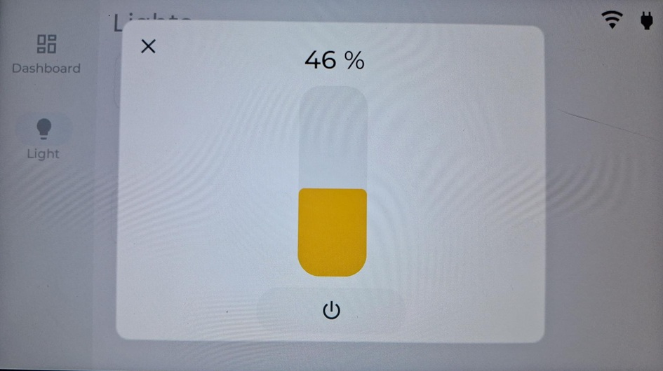
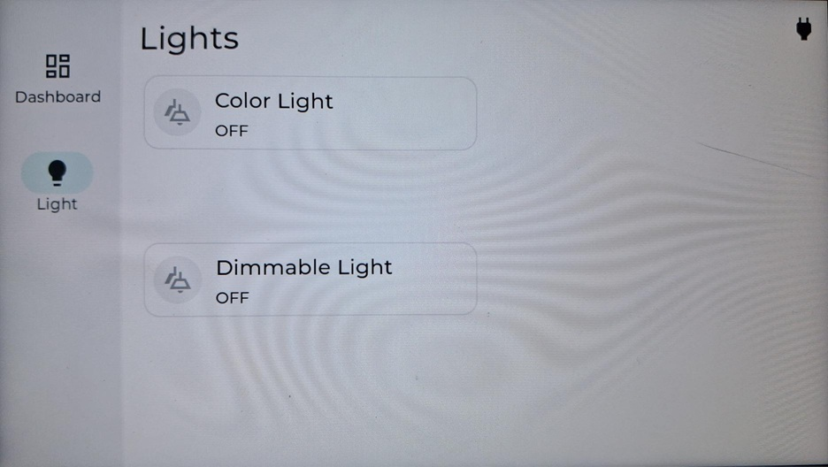
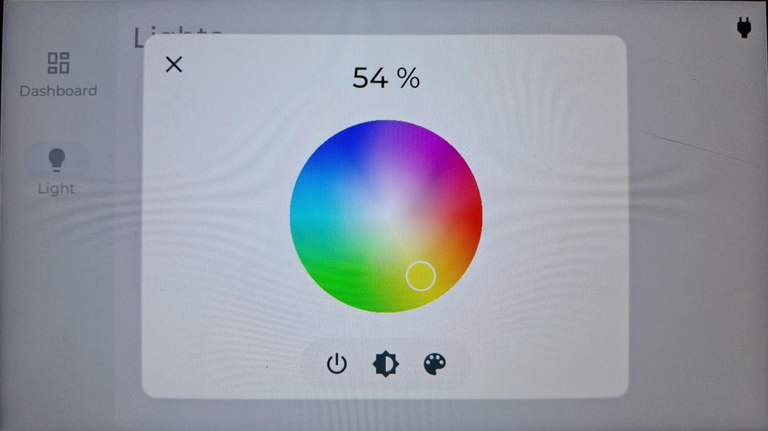

# EmbeddedWorld_M5Stack_TAB5_Demo
ESPHome YAML file for M5Stack TAB5 Demo - ESP32P4

This is the YAML file based on M5Stack TAB5 V2 device using the Espressif esp32-p4 SoC.
For more information about the device go to: https://docs.m5stack.com/en/core/Tab5

This YAML file is based on the content from https://github.com/m5stack/esphome-yaml

It is possible to build and flash the ESPHome Application usin the ESPHome CLI:

https://esphome.io/guides/cli/

https://esphome.io/guides/installing_esphome/

-----------------------------------------

# TAB5 screenshots:

